<a href="https://www.sletchersystems.com/enquire?utm_source=github&amp;utm_medium=profile&amp;utm_campaign=hire-me">
  <picture>
    <source media="(prefers-color-scheme: dark)" srcset="assets/hire-me-dark.svg">
    
  </picture>
</a>

<p align="center">
  <a href="https://www.sletchersystems.com/enquire?utm_source=github&amp;utm_medium=profile&amp;utm_campaign=hire-me"></a>
  <a href="https://www.sletchersystems.com/enquire?utm_source=github&amp;utm_medium=profile&amp;utm_campaign=hire-me"></a>
  <a href="https://www.sletchersystems.com"></a>
  <a href="https://www.sletchersystems.com/enquire?utm_source=github&amp;utm_medium=profile&amp;utm_campaign=hire-me"></a>
</p>

# Hey, I'm Wayne 👋

I'm a developer from South Africa and I'm looking for work. Contract, freelance or full-time, remote. I can start this week.

I build full-stack apps and AI stuff, and I get them live. Everything below is running right now, so click on it.

If your team looks anything like this:

```js
backlog.length > team.capacity   // true, every sprint
```

then this PR fixes it. Reviewers: you 🙂

📬 **[Send me a message](https://www.sletchersystems.com/enquire?utm_source=github&utm_medium=profile&utm_campaign=hire-me)** or email me at `wsletcher@gmail.com`

## 🚀 What I've built

**🗣️ [The English System](https://esl.sletchersystems.com)**<br>
An English learning platform built on my own teaching method, with real paying students. It has AI feedback on writing, a voice speaking partner you can talk to hands-free, and an AI avatar on every page that takes you where you need to go. Payments run through PayFast. I built it and I run it, on my own.<br>
<sub>Next.js 16 · React 19 · TypeScript · Supabase · Groq · Gemini · Whisper · Vercel · 98 merged PRs · 1,200+ tests</sub>

**🧪 [Git From Zero](https://git-lesson.sletchersystems.com)** · [code](https://github.com/banditofsmoke/01-git-and-github)<br>
Takes someone who has never opened a terminal through to branches, pull requests and fixing a merge conflict. The sandbox in it is a small git engine I wrote, so commits, rebase and reflog actually behave like git.<br>
<sub>One HTML file · no dependencies · 87 tests</sub>

**☸️ [Kubernetes & OpenShift](https://k8s.sletchersystems.com)**<br>
21 lessons and 5 browser sandboxes, plus a real 3-node cluster with a chaos tool that breaks things on purpose so you learn how to fix them.<br>
<sub>kind · Calico · Kubernetes 1.34 · 24 tests</sub>

**🏢 [Sletcher Systems](https://www.sletchersystems.com)**<br>
My agency site, in English, Afrikaans, isiXhosa and isiZulu. I built the enquiry form, the analytics and the admin dashboard behind it myself.<br>
<sub>React · Vite · Vercel · Supabase · 81 merged PRs</sub>

**🎓 TeacherSletch** (still building)<br>
A free platform for people moving into software from other careers. You apply, then prove what you can do with your own projects, and a bot checks them automatically.<br>
<sub>Python · pytest · GitHub Actions · Docker</sub>

## 🔧 Open source

- ✅ **[5 merged into Unsloth](https://github.com/unslothai/unsloth/pulls?q=is%3Apr+is%3Amerged+author%3ASletch)** (77k★)
  - [#10075](https://github.com/unslothai/unsloth/pull/10075): when broken folder permissions stopped the installer replacing its copy of Node.js, it blamed a virus scanner. Now it names the permissions as a possible cause, along with the commands that repair them.
  - [#9924](https://github.com/unslothai/unsloth/pull/9924): when a Studio update on Windows couldn't recover its launcher, the error only said the launcher wasn't on disk, which hid the real problem. Now it says why recovery failed.
  - [#12274](https://github.com/unslothai/unsloth/pull/12274): their daily compatibility check had failed every morning since two new test files landed, because those files didn't skip on machines without PyTorch. Fixed them, and added a test that catches the same mistake on the pull request that makes it, not the next morning.
  - [#11142](https://github.com/unslothai/unsloth/pull/11142): their embedding code was starting a new GPU check process on every single call. One user's log had 274 of them in about three minutes. I found where it came from and fixed it so it only checks once.
  - [#10073](https://github.com/unslothai/unsloth/pull/10073): on Windows with an Intel GPU, PowerShell was reading the installer's `-d` flag as `-Debug`, so one step of the install had never worked since it was added. Tracked it down and fixed it.
- 🟡 **[3 in review at LlamaIndex](https://github.com/run-llama/llama_index/pulls?q=is%3Apr+is%3Aopen+author%3ASletch)** (52k★) · [#23293](https://github.com/run-llama/llama_index/pull/23293) · [#23292](https://github.com/run-llama/llama_index/pull/23292) · [#23281](https://github.com/run-llama/llama_index/pull/23281)<br>
  All three are Windows bugs. Their CI doesn't run the tests on Windows, so I do.

## 🛠️ How I work

- I write tests. A fix isn't done until there's a test that fails without it.
- When I find a bug, I go check everywhere else the same bug could be hiding.
- I build with Claude, Codex, and try out MANY OTHER LLMs daily, and even some programs I have made to streamline tests, and I'm open about it. It's how I get this much done on my own.

## 🏆 Skills

[](https://github.com/unslothai/unsloth/pull/11142)
[](https://esl.sletchersystems.com)
[](https://git-lesson.sletchersystems.com)
[](https://esl.sletchersystems.com)
[](https://esl.sletchersystems.com)
[](https://www.sletchersystems.com)
[](https://esl.sletchersystems.com)
[](https://esl.sletchersystems.com)
[](https://esl.sletchersystems.com)
[](https://k8s.sletchersystems.com)
[](https://k8s.sletchersystems.com)
[](#-stuff-i-love-building-around)

## 💡 Stuff I love building around

Straight from my 2024 README. Still true, and I'm still a passionate coder and adventure-seeker 🏞️

- 🔧 Creator of Sletcher Systems and Global Defense Network
- 💻 Object-oriented programming
- 🧠 RAG systems (from tiny to industry level)
- 🤖 LLMs and Uncensored LLMs
- 🚣‍♂️ Agentic reasoning crews and tools
- 📞 Function calling
- 📊 Data science, forecasting, time series, ontologies, mapping (10M+ lines)
- 🌐 Full stack apps and machines
- 📡 Real-time communications networks
- 🔒 Cybersecurity projects
- 📈 Smart contracts
- 🔑 Hexadecimal encryptions
- 📄 LaTeX PDF generation
- 📊 Multimodal models
- 💾 Memory and thread script management

## 🐛 Known issues

- **This profile looks quiet.** Most of my product code lives in private repos on [@banditofsmoke](https://github.com/banditofsmoke). Happy to walk you through any of it on a call.
- **Timezone is UTC+2.** Won't fix. I overlap with Europe all day and the US in the morning, so it's more of a feature.
- **Doesn't do teaching jobs.** Also won't fix. I don't want to teach anymore, I want to code and build.

## 🔀 How to merge

<div align="center">

<a href="https://www.sletchersystems.com/enquire?utm_source=github&amp;utm_medium=profile&amp;utm_campaign=hire-me"></a>

📬 `wsletcher@gmail.com`

<i>Let's connect and build something amazing together!</i>

</div>
